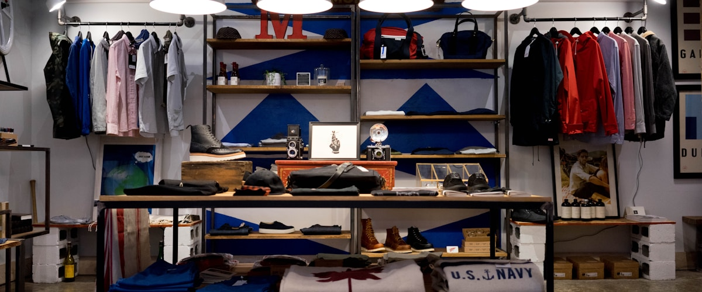

# HTML Mock Home Page

This directory contains a complete HTML mockup of a home page that can be converted to EDS (Edge Delivery Services) storefront blocks.

## Structure

```
html-mock/
├── index.html          # Main HTML file
├── css/
│   └── styles.css     # All styles
├── js/
│   └── main.js        # JavaScript functionality
├── images/            # Image assets (placeholder images needed)
├── media/             # Media files
└── README.md          # This file
```

## Components Included

1. **Header** - Navigation and header actions
2. **Hero Banner** - Large banner with CTA buttons
3. **Teaser Content** - Feature cards (4 columns)
4. **Featured Products** - Product grid (4 products)
5. **Video Embed** - YouTube video embed
6. **Testimonials** - Customer testimonials (3 cards)
7. **Newsletter** - Email subscription form
8. **Footer** - Site footer with links

## Converting to EDS Blocks

### Step 1: Identify Block Candidates

- **Hero Banner** → Use existing `hero` block or create `hero-banner`
- **Teaser Content** → Use `cards` block or create `teaser-content`
- **Featured Products** → Use `product-list-page` or create `featured-products`
- **Video Embed** → Use existing `video` or `embed` block
- **Testimonials** → Create `testimonials` block
- **Newsletter** → Create `newsletter` block

### Step 2: Extract HTML Structure

For each component:
1. Copy the HTML structure
2. Identify CSS classes and styles
3. Note JavaScript functionality
4. Create block files in `/blocks/` directory

### Step 3: Convert to da.live Table Format

Each component needs to be converted to table format for da.live:

**Example - Hero Banner:**
```
---
```

| Hero-Banner |
|-------------|
|  |
| Welcome to Our Store |
| Discover amazing products at unbeatable prices |
| [Shop Now](/products) |
| [Learn More](/about) |

### Step 4: Create Block Files

For each new block:
- `blocks/block-name/block-name.js` - Transform function
- `blocks/block-name/block-name.css` - Styles
- `blocks/block-name/_block-name.json` - da.live config (optional)

## Images

The HTML currently uses placeholder images from `via.placeholder.com`:
- Hero Banner: 1200x500px blue placeholder
- Products: 400x400px colored placeholders (blue, green, orange, red)

**To use your own images:**
1. Add your images to the `images/` directory
2. Update the `src` attributes in `index.html`:
   - `images/hero-banner.jpg` (1200x500px recommended)
   - `images/product-1.jpg` through `product-4.jpg` (400x400px)

## Testing

1. Open `index.html` in a browser
2. Verify all components render correctly
3. Test responsive design (mobile/tablet/desktop)
4. Check JavaScript functionality

## Next Steps

1. Review the HTML structure
2. Identify which components to convert first
3. Start converting one component at a time
4. Test each block in EDS before moving to the next

## Notes

- All styles are in `styles.css` using CSS variables for easy theming
- JavaScript is minimal and can be enhanced
- Images are placeholders - replace with actual product images
- Video embed uses YouTube - update with your video URL
- All links are relative - update with actual routes
